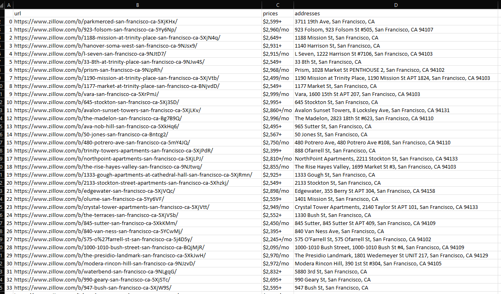
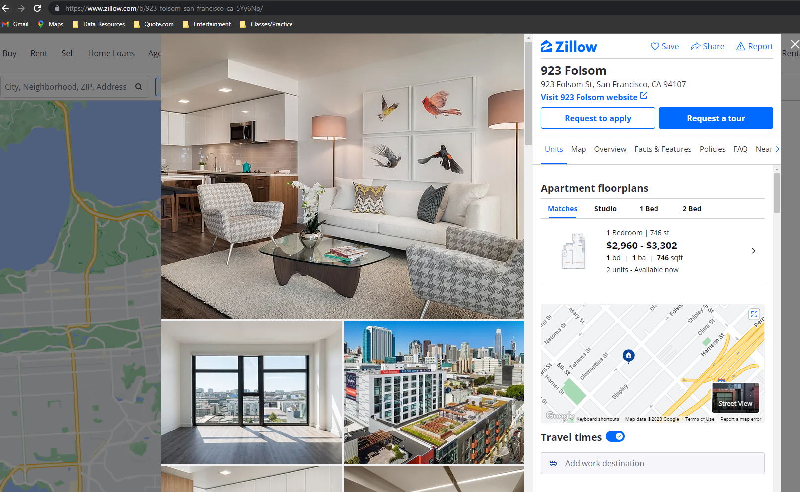

## Zillow Scraper

----
This project is meant to practice web scraping to build an application that scrapes data from Zillow and
transfers those search results to a csv file. 

Tools Used:  
requests  
pandas  
BeautifulSoup

----
### Images: 
Final file results: 
 

  
Search result example from scraped urls: 
 
